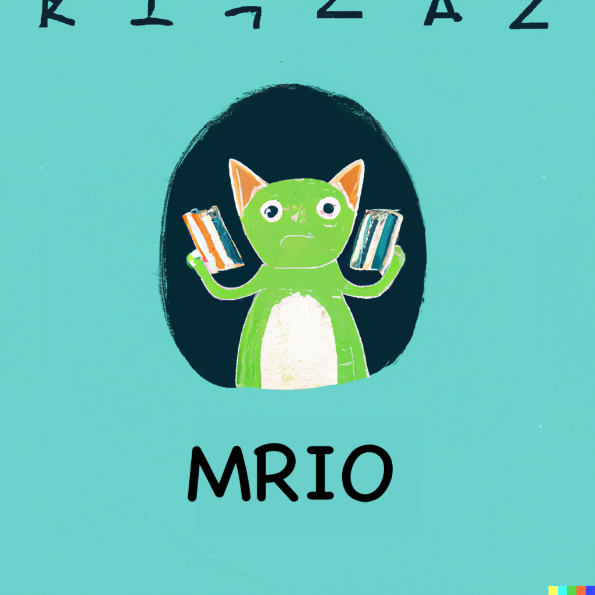

# The Mankai Reader IO Library

It's like ZIO, but with the Cats ecosystem. It has been built upon the Cats Effect IO Monad.
So it's inspired by both Snoyman's RIO and De Goes' ZIO.

## Why?

ZIO has a cool feature: it's a bifunctor. It makes error handling more expressive. But I can't
align myself with the ZIO ecosystem. I'm a Cats guy (and dogs too). So I decided to build a
bifunctor IO Monad and consequently a bifunctor Reader Monad on top of Cats Effect IO.

## How?

We exploit `Throwable` to represent errors. We can do this since we are able to inherit from
`Throwable` into a wrapper type. This force us to use unsafe things, like `asInstanceOf`, but
we can live with that since the API enforce the correct usage so we aren't able to wrongly
cast things around into types that aren't the correct ones.

This approach allows to avoid the usage of a sum like `Either`, with the inconvenience of
having to deal with `isInstanceOf` in the implementation. But this is a small price to pay
for the expressiveness of the EIO Monad.

MRIO is a Reader Monad on top of EIO. It's a Monad that depends on an environment and can
fail with an error of type `E` or succeed with a value of type `A`. While the design of
the enviroment was inspired primarily by RIO, the error handling was inspired by ZIO.
However, we weren't able to use the same approach as RIO of having a `ReaderT`, or a
`Kleisli`, since that datatype is invariant in all its type parameters. So we had to
resort to the simpler function type (as described in the article "The RIO Monad" by
Michael Snoyman).

## What?

UwU

## When?

Now.

Well, actually, it's still a work in progress. Very early stage. But it's usable. But
don't use it. But you can use it. But don't. But you can. But seriously, don't. But
it's up to you. Just wait until it's more stable idk.

## Where?

Here.

## Who?

Me.

## But is this going to be compatible with ZIO?

Probably not. But I'm not sure. While I would like to have a ZIO-like API for things
that don't have a Cats equivalent, I don't think it's possible to have a ZIO-like
API for the whole library since being compatible is not a goal of this project. Like,
for example, the variances of the type parameters are in fact ZIO-compliant, but
that doesn't mean that the whole library is ZIO-compliant. The goal is to have a
Cats-compliant library that allows a bifunctor IO Monad and a bifunctor Reader Monad
to coexist. And that's it.

## Why the name?

It was ChatGPT idea hehe. Quoting it:

  "Mankai" (満開) - Translating to "full bloom" or "in full swing," this name represents 
  the vibrant and flourishing nature of effects in your Scala library.

## License

Apache 2.0
